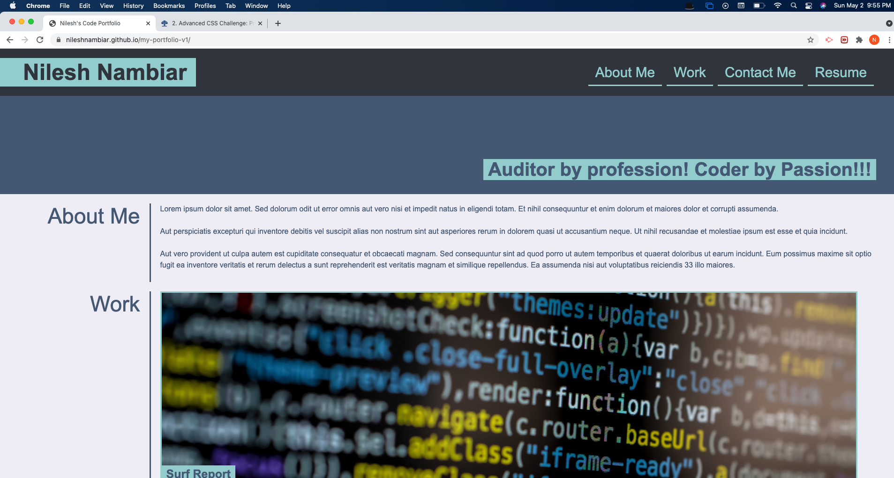

# Nilesh's Code Portfolio

## Description
Created a sample portfolio page based on mock-up received ensuring the following:
* Prepared the portfolio page as close to the mock-up as possible
* Updated my name and contact details
* Applied links to the project titles and where projects are yet to be completed, they link to a Work In Progress page.
* The run-buddy site which is completed has been linked on the portfolio page
* Sections within the page have been linked in the navigation bar

## Pending Points
Due to shortage of time, I was not able to complete the following tasks:
* On presentment, image being presented should be larger that others
* clicking on the image should go to the deployed application
* the website should be mobile responsive

## Screenshot of the deployed website

## URL of the deployed website:
[Nilesh's Code Portfolio](https://nileshnambiar.github.io/my-portfolio-v1/)
